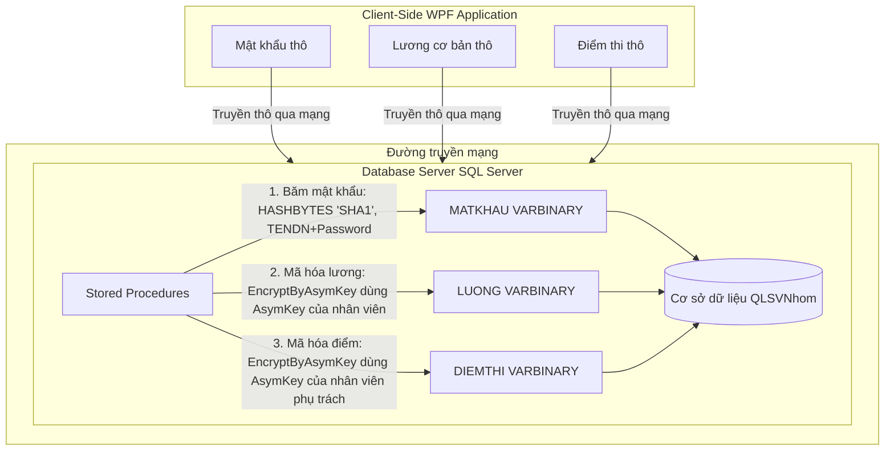

# Kimi - Hệ Thống Quản Lý Sinh Viên Bảo Mật - Lab 3

<!-- Các Badges giới thiệu và công nghệ -->
[](https://opensource.org/licenses/MIT)
[](https://dotnet.microsoft.com)
[](https://www.microsoft.com/sql-server)
[]()

Một hệ thống quản lý thông tin sinh viên, lớp học và học phần chuyên nghiệp trên nền tảng **WPF (C#)**. Hệ thống tích hợp cơ chế **bảo mật dữ liệu mạnh mẽ tại phía Database (Database-Side Security)** bằng cách sử dụng các tính năng mã hóa nâng cao của Microsoft SQL Server, giúp bảo vệ an toàn thông tin nhạy cảm của người dùng và sinh viên.

---

## Mục lục
1. [Giới thiệu & Tính năng](#giới-thiệu--tính-năng)
2. [Cơ chế bảo mật cốt lõi](#cơ-chế-bảo-mật-cốt-lõi)
3. [Công nghệ sử dụng](#công-nghệ-sử-dụng)
4. [Hướng dẫn khởi chạy cục bộ](#hướng-dẫn-khởi-chạy-cục-bộ)
5. [Cấu trúc thư mục](#cấu-trúc-thư-mục)
6. [Quy trình đóng góp (Git Flow)](#quy-trình-đóng-góp-git-flow)
7. [Tác giả](#tác-giả)
8. [Giấy phép](#giấy-phép)

---

## Giới thiệu & Tính năng

**Kimi (Lab 3)** là giải pháp quản lý sinh viên chuyên nghiệp tập trung vào bảo mật dữ liệu cấp cơ sở dữ liệu. Điểm cốt lõi của hệ thống là việc ứng dụng các thuật toán mã hóa bất đối xứng **RSA-2048** và hàm băm bảo mật **SHA-1** trực tiếp bên trong các Stored Procedure của SQL Server, đảm bảo dữ liệu điểm số thi và lương của nhân viên luôn được lưu trữ dưới dạng mã hóa an toàn.

### Các tính năng cốt lõi:
- **Quản lý Lớp học:** Nhân viên quản lý danh sách các lớp học được phân công phụ trách.
- **Quản lý Sinh viên:** Quản lý chi tiết hồ sơ sinh viên, thực hiện các thao tác thêm mới, cập nhật thông tin và xếp lớp.
- **Quản lý Học phần:** Lưu trữ danh mục các môn học và số tín chỉ tương ứng.
- **Mã hóa Điểm thi (RSA-2048):** Điểm thi được mã hóa trực tiếp tại Database bằng khóa công khai (Asymmetric Key) của nhân viên phụ trách lớp thông qua Stored Procedure.
- **Giải mã & Xem Điểm (Transcripts):** Chỉ nhân viên sở hữu khóa riêng tương ứng mới có thể giải mã và xem điểm thực tế của sinh viên do mình quản lý.
- **Bảo mật Lương:** Lương cơ bản của nhân viên được mã hóa đối xứng tại Database bằng cách sử dụng Asymmetric Key của chính nhân viên đó.
- **Giám sát Truy vấn Real-time:** Hộp thoại giám sát SQL Profiler trực tiếp trong ứng dụng giúp theo dõi các câu lệnh SQL đang thực thi trên hệ thống trong thời gian thực.

---

## Cơ chế bảo mật cốt lõi

Khác với mô hình mã hóa tại Client của Lab 4, **Lab 3** triển khai mô hình **An toàn thông tin phía Database (Database-Side Security)** thông qua các Stored Procedure:

### 1. Băm Mật khẩu (SHA-1 Salted tại Database)
- Mật khẩu nhân viên và sinh viên khi gửi lên Database sẽ được băm bằng thuật toán **SHA-1** kết hợp muối dạng chuỗi: `TENDN + "|" + Password` thông qua hàm `HASHBYTES('SHA1', ...)` tích hợp sẵn của SQL Server.
- Cột `MATKHAU` có kiểu `VARBINARY(MAX)` lưu trữ chuỗi hash nhị phân này.

### 2. Mã hóa Lương & Điểm số (Database-side RSA-2048)
- Khi tạo nhân viên mới, hệ thống tự động tạo một cặp khóa Asymmetric Key trên SQL Server với tên khóa trùng với `MANV` (thuật toán `RSA_2048`, bảo vệ bằng mật khẩu của nhân viên).
- Lương và Điểm thi được mã hóa tại Database bằng hàm `EncryptByAsymKey` và giải mã bằng hàm `DecryptByAsymKey` kết hợp mật khẩu xác thực của nhân viên sở hữu khóa.

### Sơ đồ Kiến trúc Bảo mật phía Database:



---

## Công nghệ sử dụng

Hệ thống được thiết kế theo cấu trúc MVVM, phân tách rõ ràng và có tính thẩm mỹ giao diện cao:

- **Frontend UI/UX:** Windows Presentation Foundation (WPF), giao diện hiện đại với phông chữ Montserrat, tông màu chủ đạo Teal (#0F766E) và bóng đổ thẻ Card trực quan.
- **Backend & Logic:** C# .NET Framework 4.8.
- **Data Access Layer:** Micro-ORM Dapper (nhẹ, tối ưu hiệu năng và tránh SQL Injection tuyệt đối thông qua tham số hóa truy vấn).
- **Database Engine:** Microsoft SQL Server (tích hợp Master Key, Asymmetric Keys bảo mật dữ liệu).
- **Libraries:** `Newtonsoft.Json` (xử lý JSON), `ClosedXML` (xuất báo cáo Excel), `LiveCharts` (biểu đồ thống kê).

---

## Hướng dẫn khởi chạy cục bộ

Để cài đặt và vận hành hệ thống cục bộ, vui lòng thực hiện theo các bước tuần tự dưới đây:

### 1. Yêu cầu hệ thống tiên quyết
- Máy tính chạy hệ điều hành **Windows**.
- **.NET Framework 4.8 SDK** & Runtime (hỗ trợ Visual Studio 2022 hoặc .NET CLI).
- **Microsoft SQL Server** (bản 2019, 2022 hoặc mới hơn).
- **SQL Server Management Studio (SSMS)** hoặc Azure Data Studio.
- **Git** cài đặt sẵn trên máy.

### 2. Các bước cài đặt tuần tự

**Bước 1: Sao chép mã nguồn về máy local**
```bash
git clone https://github.com/zeus058/BMCSDL_Lab.git
cd BMCSDL_Lab
```

**Bước 2: Cài đặt và cấu hình Cơ sở dữ liệu**
Đảm bảo máy chủ SQL Server đang hoạt động (Ví dụ Server có tên là `ZEUS`). Thực thi các tệp tin SQL trong thư mục [DatabaseScripts](file:///d:/BMCSDL/LAB_BMCSDL - Lab3/src/DatabaseScripts) theo đúng thứ tự:

1. Chạy [01_Schema.sql](file:///d:/BMCSDL/LAB_BMCSDL - Lab3/src/DatabaseScripts/01_Schema.sql) để tạo database `QLSVNhom` và thiết lập Master Key.
2. Chạy [02_Procedures.sql](file:///d:/BMCSDL/LAB_BMCSDL - Lab3/src/DatabaseScripts/02_Procedures.sql) để tạo các Stored Procedure nghiệp vụ bảo mật Database-side.
3. Chạy [03_SeedData.sql](file:///d:/BMCSDL/LAB_BMCSDL - Lab3/src/DatabaseScripts/03_SeedData.sql) để nạp dữ liệu mẫu (Nhân viên, Sinh viên, Lớp...).

> [!NOTE]
> **Mật khẩu mặc định của các tài khoản mẫu sau khi chạy seed data:**
> - Nhân viên 1: Tài khoản `nva` - Mật khẩu `abcd12`
> - Nhân viên 2: Tài khoản `ttb` - Mật khẩu `pass123`
> - Mật khẩu của tất cả sinh viên mẫu: `sv123` (Ví dụ SV01 tài khoản `lvc` - mật khẩu `sv123`).

**Bước 3: Cấu hình chuỗi kết nối ứng dụng (Connection String)**
Mở tệp [App.config](file:///d:/BMCSDL/LAB_BMCSDL - Lab3/src/StudentManager/App.config) trong thư mục dự án và điều chỉnh thuộc tính `connectionString` cho khớp với SQL Server của bạn:

```xml
<connectionStrings>
    <add name="QLSVNhom" 
         connectionString="Data Source=YOUR_SERVER_NAME;Initial Catalog=QLSVNhom;Integrated Security=True;Encrypt=True;TrustServerCertificate=True;" 
         providerName="System.Data.SqlClient" />
</connectionStrings>
```

> [!WARNING]
> **Bảo mật thông tin tuyệt đối:** Không bao giờ đẩy các thông tin kết nối nhạy cảm (như tài khoản `sa` kèm mật khẩu thực tế) lên Git. Hãy sử dụng cơ chế Windows Authentication (`Integrated Security=True`) ở môi trường phát triển local.

**Bước 4: Build và chạy ứng dụng**
Biên dịch dự án WPF bằng dòng lệnh hoặc mở thư mục nguồn bằng Visual Studio 2022:
```bash
dotnet build src/StudentManager/StudentManager.csproj
```
Tiến hành chạy ứng dụng sau khi build thành công!

---

## Cấu trúc thư mục

Sơ đồ hình cây trực quan thể hiện kiến trúc phân lớp của dự án:

```text
LAB_BMCSDL - Lab3/
├── Documentation/               # Tài liệu thiết kế hệ thống và đề bài thực hành
│   ├── README.md                # Tài liệu hướng dẫn sử dụng gốc
│   └── lab03.pdf                # Đề bài các môn học liên quan
├── src/
│   ├── DatabaseScripts/         # Các Script CSDL SQL Server
│   │   ├── 01_Schema.sql        # Cấu trúc bảng vật lý và MASTER KEY
│   │   ├── 02_Procedures.sql    # Các stored procedures bảo mật Database-side
│   │   ├── 03_SeedData.sql      # Nạp dữ liệu mẫu (Nhân viên, Sinh viên, Lớp...)
│   │   ├── Tool_Profiler.sql    # Extended Events kiểm tra truy vấn SQL
│   │   └── Tool_Tests.sql       # Chạy Unit Tests tự động trên database
│   │
│   └── StudentManager/          # Mã nguồn ứng dụng WPF C# (.NET 4.8)
│       ├── App.config           # Tệp cấu hình Connection String
│       ├── Theme.xaml           # Hệ thống Styles, Phông chữ, Palette màu Teal
│       ├── Helpers/             # Các thư viện tiện ích mã hóa và kết nối
│       │   ├── CryptoHelper.cs       # Quản lý khóa RSA, băm SHA-1 nhị phân cục bộ
│       │   ├── DatabaseHelper.cs     # Quản lý kết nối Dapper CSDL
│       │   └── RsaKeyProvisioning.cs # Quản lý cặp khóa RSA mẫu
│       ├── Models/              # Lớp đối tượng (Entities/DTOs)
│       ├── ViewModels/          # Điều khiển logic hiển thị (Tầng VM)
│       └── Views/               # Giao diện XAML (Tầng View)
├── rule_README.md               # Quy chuẩn viết tài liệu README
└── README.md                    # File tài liệu hướng dẫn chính này (bản hoàn chỉnh)
```

---

## Giấy phép

Dự án này được phân phối công khai và cấp phép hợp pháp dưới dạng **Giấy phép MIT License**. Thông tin chi tiết vui lòng xem tại tệp `LICENSE` đính kèm trong thư mục gốc.
